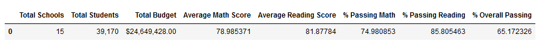
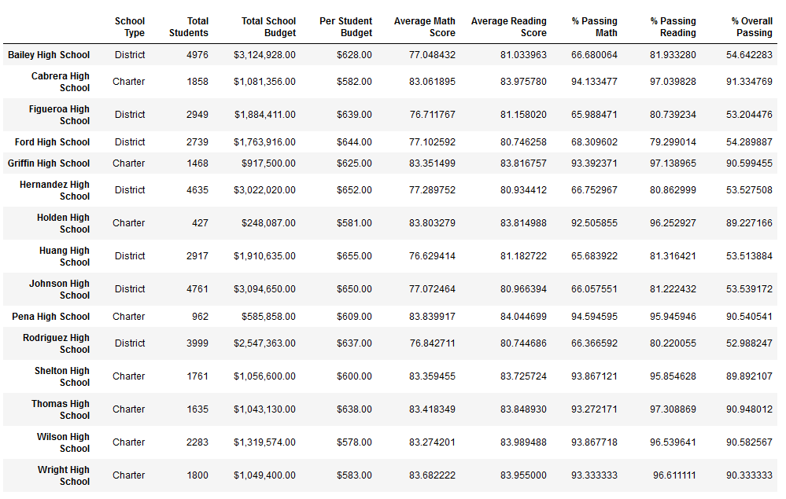
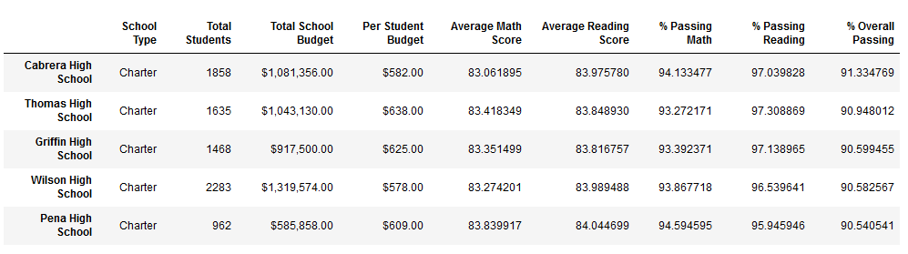
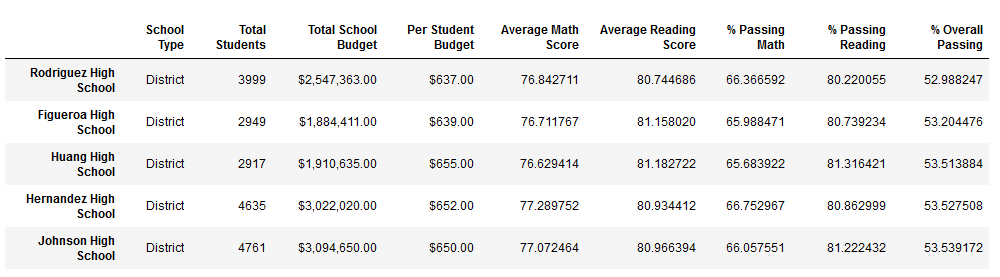
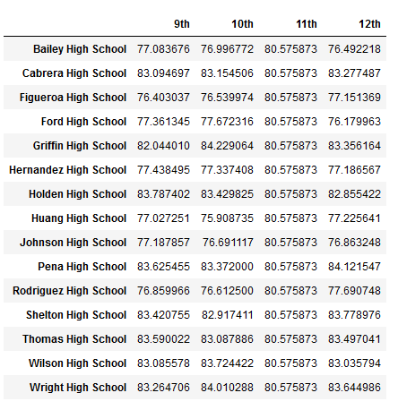
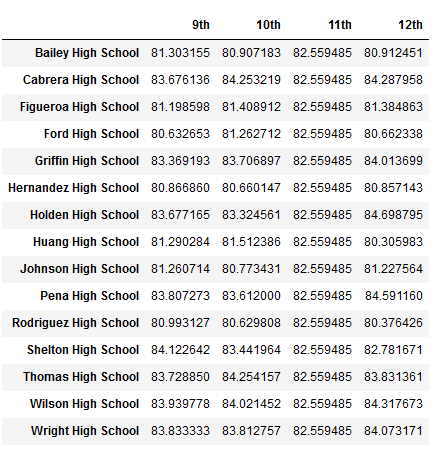
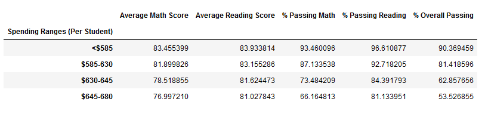
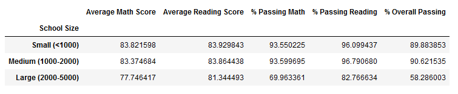
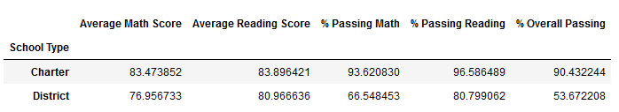

# Analyzing School District Data using Jupyter Notebook & Pandas

## Resources
Data sources: schools_complete.csv, students_complete.csv

Software: Python 3.9.7; Jupyter Notebook 6.4.11; pandas 1.3.5

## Project Overview
**Use the school data provided to complete the analysis of a school district.**

Tasks include:
1. Creating a table displaying the school district's key metrics
2. Creating a table displaying the key metrics for each individual school
3. Creating tables displaying the top 5 and bottom 5 schools based on % Overall Passing
4. Creating tables displaying the average math and reading scores received by students in each grade level at each school
5. Creating tables displaying the school performance based on the budget per student, school size, and type of school

## Results & Analysis

The school district comprises 15 schools, with a student population of 39,170 and a budget of $24,649,428. The average math and reading scores are 78.9% and 81.8%, while the corresponding average percentages for passing math and reading are 74.9% and 85.8%, respectively. The overall passing percentage is 65.1%.

The table above presents key metrics for each school, including the number of students which ranges from 427 to 4,976, as well as the % Overall Passing, which varies from 52.9% to 91.3%.

Based on % Overall Passing, the highest performer was Cabrera High School, which achieved a score of 91.3%.

Based on % Overall Passing, the lowest performer was Rodriguez High School, which achieved a score of 52.9%.

The table above displays the average math scores received by students in each grade level at each school. The highest performers were the 10th graders from Griffin High School with an average math score of 84.2 and the lowest performers were the 10th graders from Huang High School with an average math score of 75.9.

The table above displays the average reading scores received by students in each grade level at each school. The highest performers were the 12th graders from Holden High School with an average reading score of 84.6 and the lowest performers were the 12th graders from Huang High School with an average reading score of 80.3.

Schools that spent less than $585 per student received the highest % Overall Passing (90.3%), while schools that spent $645-680 per student received the lowest % Overall Passing (53.5%).

Schools that had less than 1000 students received the highest % Overall Passing (89.8%), while schools that had between 2000-5000 students received the lowest % Overall Passing (58.2%).

Charter schools received the highest % Overall Passing (90.4%), while District schools received the lowest % Overall Passing (53.6%).

## Drawing Insights

- As a whole, schools with higher budgets, did not yield better test results. By contrast, schools with higher spending $645-680 per student actually underperformed compared to schools with smaller budgets (<$585 per student).
- As a whole, smaller and medium sized schools dramatically out-performed large sized schools on passing math performances (89-91% passing vs 58%).
- As a whole, charter schools out-performed the public district schools across all metrics. However, more analysis will be required to glean if the effect is due to school practices or the fact that charter schools tend to serve smaller student populations per school. 

---
Return to the [Homepage](https://kenlo94.github.io/)
